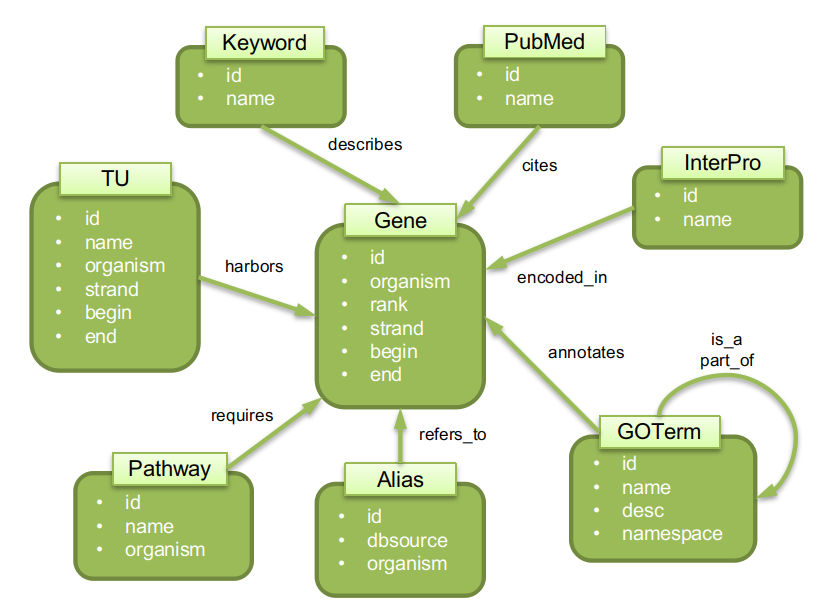

# Consignes du rapport

## Calendrier

La date de remise du rapport est fixée au 5 novembre 2024. Envoi par mail ou lien vers une archive à télécharger comprenant au minimum :
* le rapport au format PDF,
* le script python de recherche d'enrichissement et la base de données neo4j 

## Travail à réaliser

Travail à réaliser obligatoirement de manière individuelle si vous n'avez pas assisté aux enseignements jusqu'à la fin, sinon vous pouvez le faire en binôme (mais le binôme doit être différent de celui du projet de la première partie de l'UE sur les JO).

## Constitution de la base de données

Base de données Neo4J avec les informations sur :
* Gene : les gènes et leur position sur le(s) chromosome(s)
* Alias : les alias/synonymes des noms de gènes
* Keyword (UniProt Proteome)
* InterPro Domains (UniProt Proteome)
* PubMed (GenBank/RefSeq)
* TU (EcoCyc)
* Pathway (EcoCyc)
* GOTerm (Gene Ontology + UniProt Proteome)
* scores d'association entre paires de gènes/protéines basés sur la coexpression, le lien phylogénomique, et l'interaction protéine-protéine (StringDB) 

A titre d'illustration et d'exemple le schéma ci-dessous est inclus :

***Fig. 1: Schéma illustrant les sommets et liens de la base de données***

## Ajout de fonctionnalités au script de recherche d'enrichissement blastsets.py

**Notation** : On considère un ensemble requête Q (query) et un ensemble cible T (target, appartenant à un jeu de données de référence). Les deux ensembles sont inclus dans l'ensemble des gènes de l'organisme G (genome). Ils ont respectivement des cardinalités q, t, g. L'intersection des ensembles Q et T a une cardinalité c.

Il s'agit de proposer d'autres mesures de similarités.

### Coverage

La première mesure à intégrer est naïve (pas statistique) que l'on nommera coverage et consiste à considérer quelles fractions des 2 ensembles se correspondent. Pour la cohérence avec les autres mesures (et faciliter le tri de résultats de manière croissante), la valeur sera de 1 quand aucun élément n'est commun aux 2 ensembles, et 0 pour 2 ensembles identiques. Il s'agit donc de multiplier c/q par c/t avec c le nombre d'éléments communs aux ensembles Q et T respectivement de cardinalités q et t, et de soustraire cette valeur à 1.

### χ2 d'indépendance

La deuxième mesure à ajouter est un χ2 d'indépendance en considérant les ensembles Q et T comme 2 facteurs (variables qualitatives). Le test est donc à effectuer sur la table de contingence :

| | T | G\T | Σ |
|-|---|-----|---|
| Q | c | q-c | q |
| G\Q | t-c | g-q-t+c | g-q |
| Σ | t | g-t | g |

### Loi hypergéométrique

Il s'agit d'ajouter une mesure basée sur la loi hypergéométrique (aussi appelée, selon le contexte, test exact de Fisher). Cela correspond à considérer les 2 ensembles Q et T comme 2 échantillons aléatoires, avec remise (loi binomiale) ou sans remise (loi hypergéométrique), et de calculer la probabilité d'avoir au moins autant d'éléments C en commun (par hasard).

## Comparaison des mesures disponibles

Proposez une approche et comparez les différentes mesures intégrées au script. Le but est de déterminer laquelle il est préférable d'utiliser et dans quel(s) cas.

Il vous faudra donc proposer et décrire, dans un premier temps, une méthode permettant d'effectuer cette comparaison, soit de manière analytique (basée sur les hypothèses et calculs associés à chaque mesure), soit de manière empirique (basée sur des ensembles requêtes synthétiques permettant d'évaluer quelle mesure fait remonter les résultats souhaités), puis, dans un deuxième temps, de mettre en oeuvre cette méthode pour obtenir des résultats. Les résultats seront ensuite à interpréter et à discuter afin de conclure sur les aspects positifs et négatifs des différentes mesures, et éventuellement de proposer des perspectives.

## Analyse d'un ensemble de gènes d'intérêt fourni

Chaque étudiant·e fera l'analyse d'un ensemble de gènes fourni. Les ensembles sont disponibles au téléchargement sur le gitlab suivant : query sets pour le projet. Les ensembles sont disponibles ci-dessous. Le numéro correspondant à chaque étudiant (son numéro de PC en U2-207) fait partie du nom du fichier. Par exemple, la personne qui est habituellement sur le pc7 prendra le fichier set.M2.7.txt Il ne doit donc pas y avoir 2 étudiants avec le même set (les places attribuées/choisies en début d'année servent de référence).

L'analyse consiste à caractériser l'ensemble de gènes fourni par les méthodes d'enrichissement ou de sur-représentation statistique (script réalisé plus haut) en interrogeant l'ensemble des données intégrées dans votre base de données Neo4J. Une fois les recherches effectuées, il faudra synthétiser et commenter les informations retenues comme pertinentes à l'aide, éventuellement, d'illustrations comme celles présentées en cours.

# Rapport à rendre

## Il doit inclure
* une brève introduction générale décrivant le contexte, les objectifs et le plan de ce qui suit.
* intégration et préparation des données
	* données, librairies et programmes utilisés (sans oublier les versions)
	* choix effectués lors de l'intégration
	* statistiques descriptives sur les données intégrées (ex: nombre de gènes, GOTerms, références PubMed, etc., et nombre de liens entre ces entités, distributions des échantillons et graphiques d'illustration, etc.) 
* ajout de fonctionnalités :
	* des explications sur les modifications apportées au script original,
	* comment utiliser le script modifié,
	* un exemple d'utilisation des fonctionnalités ajoutées. 
* comparaison des mesures intégrées :
	* approches envisagées et méthode pour en sélectionner une
	* mise en oeuvre
	* synthèse des résultats obtenus
	* bilan : quelle mesure utiliser de préférence, pourquoi
	* perspectives d'amélioration 
* analyse de l'ensemble de gènes fourni (une analyse par personne du binôme si vous faîtes le projet à 2)
	* résultats obtenus par la recherche d'enrichissement
	* discussion et commentaires sur ce qui caractérise cet ensemble, avec, illustrations si pertinentes et utiles 
* bilan personnel sur le projet et l'UE : motivations ? critiques ? suggestions ? apports ? ... ?
* pour les binômes, indiquer qui a réalisé quelle partie (rédaction, code, analyse, ...)
* aide extérieure (étudiant, collaborateur, ...) et ressources utilisées (ChatGPT, ...) à la fois pour les aspects techniques; et à la fois d'un point de vue communication (rédaction)

## Contraintes :
* Le rapport doit être au format PDF.
* Le rapport peut être en anglais ou en français mais pas les 2.
* Le script modifié et les éventuels jeux de tests utilisés et résultats obtenus doivent être fournis ou disponibles sous forme d'archive ou projet gitlab. 

**Remarque** : une attention toute particulière sera portée aux soins apportés au rapport final et à sa qualité globale, à sa lisibilité, sa pertinence ainsi qu'au niveau du langage employé (français/anglais, scientifique, rigoureux, usage du vocabulaire consacré au domaine, orthographe et grammaire). 

>[!WARNING]
> L'enseignant ne veut pas de *blabla* mais trouve intéressant de savoir quel gène n'est jamais cité (PubMed) par exemple, le nombre de gènes de l'organisme et le pourcentage d'annotation : Statistiques descriptives.
> Les codes seront en annexe.
