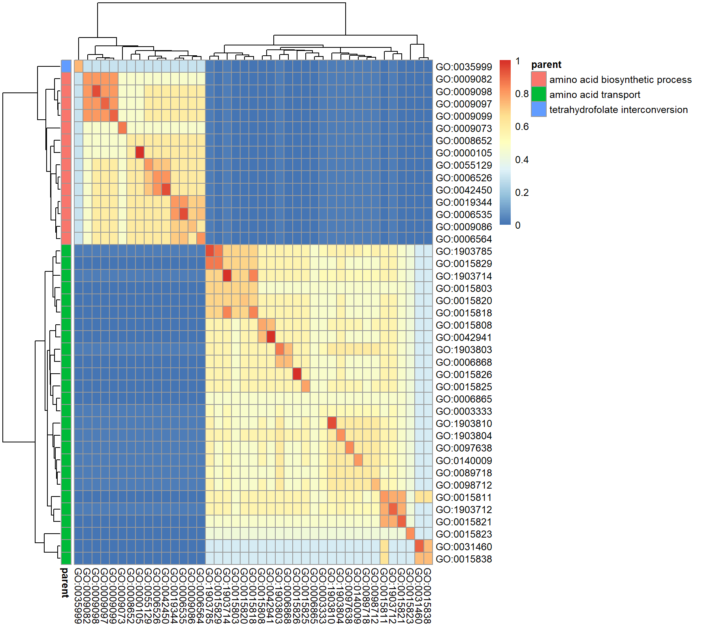
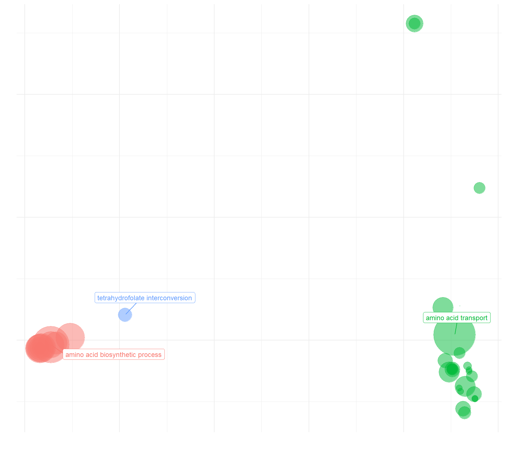
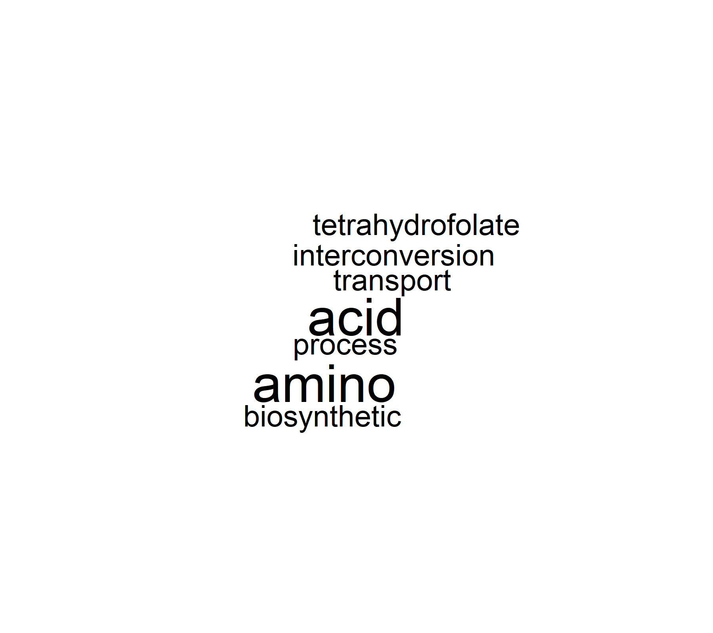
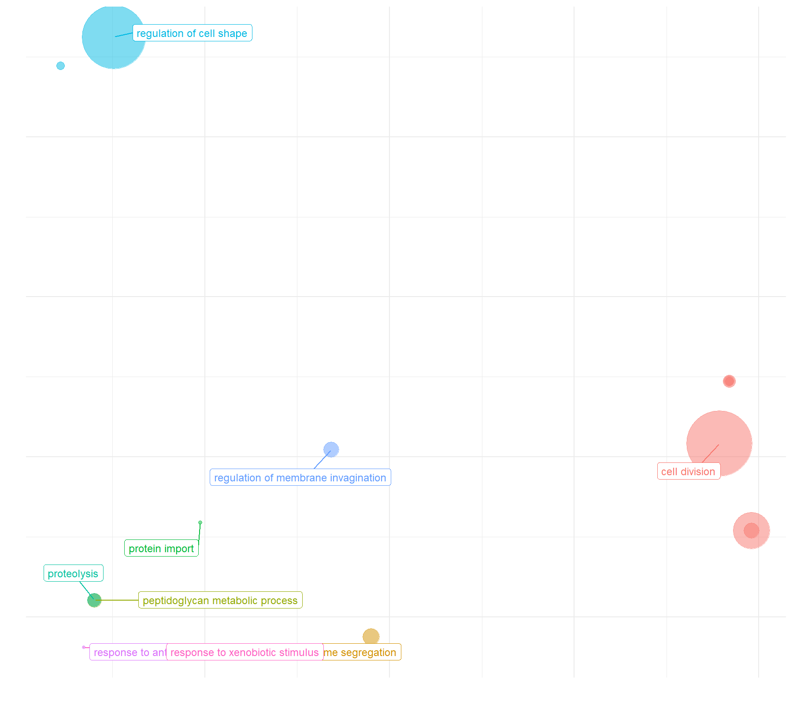
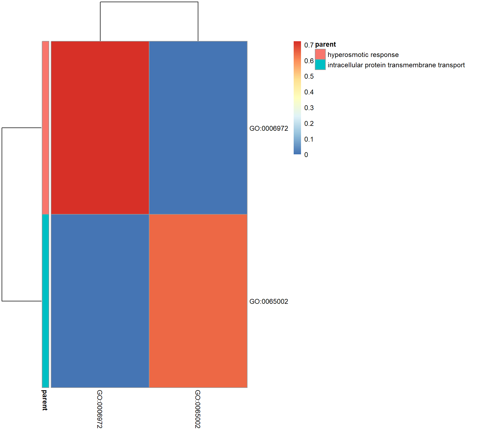
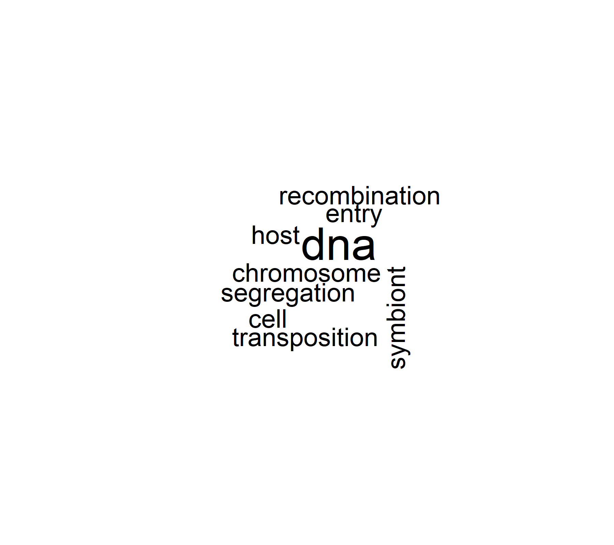

# Introduction

Ce projet s’inscrit dans le cadre de l’unité d'enseignement *Gestion des Données Non Structurées* et vise à construire une chaîne complète d’intégration, de structuration et d’analyse de données biologiques hétérogènes. L’objectif principal était d'unifier plusieurs sources d’information concernant *Escherichia coli K-12 MG1655*, notamment EcoCyc, UniProt, InterPro, NCBI, Gene Ontology et STRINGdb, afin de les représenter au sein d’une base de donnée graphe Neo4j. Cette approche permet de modéliser explicitement les relations complexes entre gènes, protéines, domaines fonctionnels, pathways et interactions moléculaires.

L’environnement de travail reposait sur un système reproductible utilisant mamba, R, Python et une instance Neo4j via conteneur. Les scripts développés ont permis d’automatiser le téléchargement, le prétraitement et le chargement des données, puis d’extraire des mesures de similarité fonctionnelle et de coexpression exploitées pour la priorisation de gènes. Plusieurs ensembles de gènes ont ainsi été analysés à l’aide de méthodes d’enrichissement GO, d’analyses multivariées (PCA, LDA) et de visualisations structurales.

Au-delà de la mise en œuvre technique, ce travail répond à un enjeu central : démontrer comment des données non structurées, disparates et souvent difficiles à exploiter peuvent être transformées en un graphe biologique cohérent permettant l’interprétation fonctionnelle de jeux de gènes.

# Intégration et préparation des données

L’ensemble des analyses réalisées dans ce projet repose sur la mise en place d’une chaîne d’intégration de données reproductible, permettant d’unifier des sources hétérogènes (bases de connaissances, génomes, ontologies, fichiers d’annotations, résultats d’analyses externes). Cette section décrit l’environnement logiciel utilisé, les sources de données, ainsi que les différentes étapes de préparation nécessaires avant le chargement dans la base de graphes Neo4j et l’exploitation analytique dans R et Python.

## 1. Environnement logiciel et reproductibilité

Afin de garantir la reproductibilité des traitements, l’ensemble du projet a été réalisé dans un environnement contrôlé :

* **mamba v2.1.1**
  Utilisé pour créer et gérer l’environnement logiciel, notamment les versions spécifiques de R et Python requises par les librairies de modélisation et d’analyse.

* **R v4.4.3**
  Utilisé pour la majorité des analyses statistiques, le traitement de données, l’intégration de STRINGdb et la construction des graphes via Neo4j. Les scripts d’analyse s’exécutent intégralement dans cet environnement.

* **Python v3.12.11**
  Utilisé pour le prétraitement de données et la génération des fichiers d’ontologies.

* **Neo4j 5.26.12 (community edition)**
  Déployé à partir de l’image officielle Docker/Podman `neo4j:5.26.12-community`, et exécuté via **podman v5.5.2**.
  Cette configuration permet un déploiement isolé, reproductible et facilement réinitialisable, essentiel pour les tests répétés et les imports successifs.

## 2. Importation des données externes

L’ensemble des données introduites dans le projet provient de sources publiques reconnues : EcoCyc, UniProt, InterPro, NCBI, Gene Ontology et STRINGdb. Pour contourner certaines contraintes techniques (notamment les restrictions liées aux sessions EcoCyc), une partie des fichiers a été récupérée via un dépôt GitLab (https://gitlab.com/rbarriot/data/-/tree/main/M2.GDNS-AP?ref_type=heads).

### 2.1. Données issues de GitLab (dépôt pédagogique)

Afin de fiabiliser les téléchargements et automatiser les scripts, plusieurs fichiers normalement récupérés depuis EcoCyc ont été téléchargés directement depuis un dépôt GitLab dédié :

#### Données EcoCyc (remplacement des téléchargements directs EcoCyc)

Les téléchargements directs EcoCyc posent problème (gestion des sessions et erreurs type `curl: (56) Recv failure`).
Ils ont été récupérés via les liens suivants :
* https://gitlab.com/rbarriot/data/-/raw/main/M2.GDNS-AP/All-instances-of-Genes-in-Escherichia-coli-K-12-substr.-MG1655.txt
* https://gitlab.com/rbarriot/data/-/raw/main/M2.GDNS-AP/All-instances-of-Pathways-in-Escherichia-coli-K-12-substr.-MG1655.txt
* https://gitlab.com/rbarriot/data/-/raw/main/M2.GDNS-AP/all-transcription-units.txt

Ces liens remplacent les suivants :
* https://www.ecocyc.org/groups/export?id=biocyc13-55140-3842501533&tsv-type=FRAMES
* https://www.ecocyc.org/groups/export?id=biocyc17-55140-3842483872&tsv-type=FRAMES
* https://www.ecocyc.org/groups/export?id=biocyc17-55140-3842483291&tsv-type=FRAMES

Les deux possibilités de téléchargement ont été conservées dans le script1.sh afin d'optimiser ultérieurement la récupération des données (notamment par la récupération et l'utilisation de fichier contenant des cookies de navigateurs ou via des identifications reconnues par le site).

#### Données complémentaires pour Neo4j

D'autres données nécessaires à l'alimentation de la base de données de Neo4j sont également été récupérées depuis ce dépôt.

* Relations entre gènes et publications : https://gitlab.com/rbarriot/data/-/raw/main/M2.GDNS-AP/pmid.selected.tsv
* Table de correspondance entre bnumber et PMIDs : https://gitlab.com/rbarriot/data/-/raw/main/M2.GDNS-AP/bnumber.PMID.tsv
* Script Python d’extraction et de formatage Gene Ontology : https://gitlab.com/rbarriot/data/-/raw/main/M2.GDNS-AP/GeneOntology.py > scripts/GeneOntology.py
* Récupération automatisée des ensembles de gènes à analyser (sets) : https://gitlab.com/rbarriot/data/-/raw/main/M2.GDNS-AP/$set.txt à partir de la liste `query.sets/liste.sets.txt` créée au préalable.

### 2.2. Données issues d’UniProt

Le protéome complet d’*Escherichia coli* K12 MG1655 (UP000000625) a été téléchargé via l’API REST UniProt : https://rest.uniprot.org/uniprotkb/stream?compressed=true&fields=accession,id,gene_oln,go_id,xref_interpro,keyword&format=tsv&query=(proteome:UP000000625)

Ces données fournissent :
* les identifiants UniProt,
* les gènes associés,
* les annotations GO,
* les domaines InterPro,
* les mots-clés UniProt (utilisés plus tard pour construire une matrice de similarité fonctionnelle).

### 2.3. Données issues d’InterPro

La liste des entrées InterPro (format court), enrichissant les profils fonctionnels des protéines, a été téléchargé via le lien : https://ftp.ebi.ac.uk/pub/databases/interpro/releases/latest/entry.list

### 2.4. Données issues du NCBI

L’annotation du génome complet (*E. coli* MG1655, accession GCF_000005845.2) a été téléchargée via l’API NCBI :
* https://api.ncbi.nlm.nih.gov/datasets/v2/genome/accession/GCF_000005845.2/download?include_annotation_type=GENOME_GBFF&hydrated=FULLY_HYDRATED

Le fichier GenBank obtenu sert notamment à :
* valider les identifiants des gènes,
* récupérer les coordonnées génomiques,
* lier les gènes aux produits protéiques correspondants.

### 2.5. Données issues de la Gene Ontology

La dernière version de la Gene Ontology au format OBO a été téléchargée depuis le serveur officiel : http://current.geneontology.org/ontology/go-basic.obo

Cette ontologie est ensuite transformée via `GeneOntology.py` pour générer :
* un fichier de nœuds (GO terms),
* un fichier d’arêtes (relations is_a, part_of),
  compatibles avec l’import Neo4j.

### 2.6. Données issues de STRINGdb

Pour intégrer les interactions protéine–protéine, coexpressions et autres scores relationnels, le fichier détaillé fourni par STRING v12 a été téléchargé pour *E. coli* (taxon 511145) : https://stringdb-downloads.org/download/protein.links.detailed.v12.0/511145.protein.links.detailed.v12.0.txt.gz

Ce fichier alimente :
* les relations STRINGdb (coexpression, expérimental, neighborhood, text mining, curated database),
* les calculs de scores combinés,
* la création des sous-graphes de coexpression dans Neo4j et R (via igraph).

## 3. Génération des données internes au projet

Toutes les autres données nécessaires au projet — fichiers pour l’import Neo4j, tables de correspondance, sous-graphes, matrices de similarité, résultats statistiques, figures, exports HTML — sont générées automatiquement par les scripts développés dans ce travail (scripts R, scripts Python, pipelines d’import Neo4j).

Ainsi, le workflow complet repose sur :
1. **des sources de données publiques contrôlées**,
2. **un environnement logiciel reproductible**,
3. **une génération automatisée des données dérivées**,
   garantissant la traçabilité et la reproductibilité des résultats obtenus.


# Ajout de fonctionnalités et difficultés rencontrées

Au cours du développement des scripts d’intégration, d’analyse et d’automatisation, plusieurs incohérences ont été identifiées. Celles-ci concernent principalement :
1. des écarts significatifs entre les résultats attendus et obtenus lors du chargement des données dans Neo4j ;
2. des comportements inattendus lors du calcul de certaines métriques (notamment les scores de coexpression ou p-value) ;
3. des problèmes liés à l’automatisation et à l’hétérogénéité de l’environnement logiciel.

Ces difficultés ont limité l’ajout de nouvelles fonctionnalités, et ont motivé la production d’une version plus simple, plus stable et orientée vers la reproductibilité, même si cette dernière n’est pas encore pleinement atteinte.

## 1. Problèmes rencontrés dans l’intégration Neo4j

L’importation des données issues d’EcoCyc, d’InterPro, de la Gene Ontology et de STRINGdb devait initialement permettre de reconstruire une base de graphes complète et cohérente. Cependant, plusieurs divergences entre les résultats attendus (référence fournie) et les résultats réellement obtenus ont été observées.

Les principales vérifications effectuées sont résumées ci-dessous :

* InterPro
	* nombre de nœuds InterPro : ```MATCH (n:InterPro) RETURN count(n)```
		* Attendu : 7735
		* Obtenu : 2405
	* nombre de liens InterPro → Gènes : ```MATCH (n:InterPro)-[r:harbored_by]->(:Gene) RETURN count(r)```
		* Attendu : 17175
		* Obtenu : 11830
Ces écarts suggèrent soit une perte d’information lors du prétraitement, soit un filtrage involontaire dans les scripts d’import.

* Transcription Units (TUs)
	* nombre de nœuds TU : ```MATCH (n:TU) RETURN count(n)```
		* Attendu : 3696
		* Obtenu : 253
	* nombre de liens TU → Gene : ```MATCH (n:TU)-[r:harbors]->(:Gene) RETURN count(r)```
		* Attendu : 0
		* Obtenu : 673
Ces résultats inversent les observations attendues avec peu de TUs créées, mais de nombreux liens `harbors` qui ne devraient pas exister.
Cela suggère une divergence dans le format des fichiers EcoCyc utilisés ou dans la logique d’extraction/parsing.

* Pathways
	* nombre de nœuds Pathways : ```MATCH (n:Pathway) RETURN count(n)```
		* Attendu : 438
		* Obtenu : 389
	* nombre de liens Pathway → Gene : ```MATCH (n:Pathway)-[r:requires]->(:Gene) RETURN count(r)```
		* Attendu : 2739
		* Obtenu : 2673
Ces écarts, bien que plus faibles, confirment une sous-intégration partielle des données EcoCyc.

## 2. Problème observé dans la fonction de scoring

La fonction `score()` calcule la distance moyenne d'un gène candidate aux gènes du pathway de référence, en s’appuyant sur les scores STRINGdb.

Voici la fonction utilisée depuis le script9.R (script9-auto.R également):

```r
score <- function(gene.ids, ref.genes, datasource) {
    # mapping datasource -> type de relation dans Neo4j
    rel_type <- switch(
        datasource,
        coexpression = "STRINGdb",
        experimental = "STRINGdb_experimental",
        neighborhood = "STRINGdb_neighborhood",
        textmining   = "STRINGdb_textmining",
        database     = "STRINGdb_database",
        stop(paste("Datasource inconnue :", datasource))
    )
    ref_str <- paste("'", ref.genes, "'", sep = "", collapse = ",")
    sapply(gene.ids, function(gene.id) {
        query <- paste0(
        "MATCH (g1:Gene {id: '", gene.id, "', organism: 511145})",
        "-[r:", rel_type, "]-",
        "(g2:Gene {organism: 511145}) ",
        "WHERE g2.id IN [", ref_str, "] ",
        "RETURN r.", datasource, " AS score"
        )
        res <- query %>% cq %>% .$score
        ifelse(is.null(res), 0, mean(replace_na(res, 0)))
    })
}
```

Le test sur le gène b0116 ne s'avère pas probant non plus.
```r
gene.ids <- 'b0116' ref.genes <- training.genes datasource <- 'coexpression' score(gene.ids, training.genes, datasource)
```
* Attendu : 233.3333
* Obtenu : 247.0588

Cet écart systématique correspond probablement à l’utilisation implicite :
* d’un set de gènes légèrement différent (selon l’import Neo4j),
* d’une différence dans les arêtes présentes,
* ou du filtrage des valeurs (exclusivement non nulles ou tous les liens attendus).

Ce delta indique une incohérence dans la base Neo4j importée, qui se répercute sur toutes les étapes de priorisation.

## 3. Contraintes liées à l’environnement et à l’automatisation

Plusieurs problèmes techniques ont également limité la fiabilité de l’automatisation :
* **Limitations liées à podman**, notamment dans la gestion des volumes pour l’import massif de CSV dans Neo4j.
* **Temps d’exécution importants**, rendant les tests successifs coûteux.
* **Scripts complexes et très dépendants de la qualité des données importées**, amplifiant l'effet des erreurs obtenues en amont.

## 4. Conséquences sur le développement : pas de nouvelles fonctionnalités

En raison de ces divergences, il n’a pas été possible d’implémenter les fonctionnalités supplémentaires envisagées au départ (statistiques diverses, lois hypergéométriques, etc).

L’effort a plutôt porté sur :
* la simplification de l’exécution
* une meilleure organisation des scripts
* la tentative d’améliorer la reproductibilité
* l’identification des sources d’erreurs
* la production d’une version stable et utilisable pour l’analyse

Même si la reproductibilité complète n’a pas encore été atteinte, la nouvelle structure du projet constitue une base plus fiable pour un futur travail d'amélioration.

# Analyse de l’ensemble de gènes fourni

L’analyse menée sur les ensembles de gènes (sets 01, 02, 03 et M2.8) repose sur des approches d’enrichissement fonctionnel (Gene Ontology), des visualisations structurelles (treemaps, heatmaps, wordclouds) et des méthodes de priorisation (coexpression, voisinage, PCA, LDA).
Les résultats permettent d’identifier des signatures biologiques robustes, bien que certaines limitations apparaissent en raison des incohérences détectées dans les données importées (InterPro, TUs, STRINGdb).

## 1. Résultats du set 01 : un ensemble cohérent centré sur le métabolisme des acides aminés

Les analyses GO mettent en évidence de grandes familles fonctionnelles, notamment le transport et la biosynthèse d’acides aminés.


<strong>Figure 1 - Treemap représentant la répartition des termes GO biologiques enrichis dans le set 01.</strong> <i>Les couleurs indiquent les grandes familles fonctionnelles (transport d’acides aminés, biosynthèse, interconversion du tétrahydrofolate). La taille des rectangles est proportionnelle au nombre de gènes associés à chaque terme.</i>

Les clusters identifiés sont cohérents et bien séparés :
* Transport d’acides aminés (groupe vert)
* Biosynthèse d’acides aminés (groupe rouge)
* Voies métaboliques au folate (groupe bleu)


<strong>Figure 2 - Heatmap montrant la similarité fonctionnelle entre les termes GO du set 01.</strong> <i>L’organisation en deux blocs principaux reflète la séparation entre transport d’acides aminés et biosynthèse.</i>


<strong>Figure 3 - Projection 2D des termes GO enrichis du set 01 selon leur similarité sémantique.</strong> <i> Les clusters confirment la structuration fonctionnelle du set.</i>


<strong>Figure 4 - Nuage de mots des termes GO du set 01.</strong> <i> Les termes majoritaires reflètent principalement le métabolisme des acides aminés.</i>

## 2. Résultats du set 02 : division cellulaire et morphogenèse

Le set 02 révèle une forte association à des processus structuraux :
* *cell division*
* *cell septum assembly*
* *regulation of cell shape*
* métabolisme du peptidoglycane


<strong>Figure 5 - Treemap représentant la répartition des termes GO biologiques enrichis dans le set 02.</strong> <i> Treemap mettant en évidence les processus liés à la division cellulaire, l’assemblage du septum et la régulation de la morphogenèse.</i>


<strong>Figure 6 - Projection 2D des termes GO enrichis du set 02 selon leur similarité sémantique.</strong> <i>Projection des termes GO du set 02 montrant des groupes bien distincts liés à la division cellulaire, à l’import protéique et à la réponse aux antibiotiques.</i>


<strong>Figure 7 - Heatmap montrant la similarité fonctionnelle entre les termes GO du set 02.</strong> <i>Heatmap organisée en grands modules fonctionnels : division cellulaire, morphogenèse, import protéique et réponse au stress.</i>


<strong>Figure 8 - Nuage de mots des termes GO du set 02.</strong> <i> Nuage de mots illustrant les termes GO prédominants : division cellulaire, régulation, peptidoglycane, membrane, stimulus.</i>

## 3. Résultats du set 03 : recombinaison et plasticité génomique

Cet ensemble présente des signatures très spécifiques :
* *DNA recombination*
* *DNA transposition*
* *chromosome segregation*


<strong>Figure 9 - Treemap représentant la répartition des termes GO biologiques enrichis dans le set 03.</strong> <i>Treemap montrant la dominance des processus de recombinaison ADN et transposition.</i>


<strong>Figure 10 - Projection 2D des termes GO enrichis du set 03 selon leur similarité sémantique.</strong> <i> Les clusters reflètent clairement les processus : recombinaison, transposition, entrée du symbionte, ségrégation chromosomique.</i>


<strong>Figure 11 - Heatmap montrant la similarité fonctionnelle entre les termes GO du set 03.</strong> <i>Heatmap révélant deux grands modules fonctionnels : recombinaison/transposition et symbionte/ségrégation.</i>


<strong>Figure 12 - Nuage de mots des termes GO du set 03.</strong> <i> Nuage de mots illustrant les termes liés à la dynamique du génome : DNA, recombination, transposition, host entry.</i>

## 4. Résultats du set M2.8 : réponse osmotique et transport intracellulaire

Ce set, plus réduit, révèle deux fonctions majeures :
* *hyperosmotic response*
* *intracellular protein transmembrane transport*


<strong>Figure 13 - Treemap représentant la répartition des termes GO biologiques enrichis dans le set M2.8.</strong> <i>Treemap simple montrant les deux grandes catégories fonctionnelles du set M2.8 : réponse hyperosmotique et transport transmembranaire intracellulaire.</i>


<strong>Figure 14 - Nuage de mots des termes GO du set M2.8.</strong> <i>Nuage de mots reflétant la surreprésentation des termes liés à la réponse hyperosmotique et au transport transmembranaire.</i>

## 5. Impact des erreurs et incohérences détectées lors des tests préalables

Avant l’analyse, plusieurs tests de cohérence ont révélé des écarts importants entre valeurs attendues et données importées. Ces incohérences ont probablement affecté :
* la priorisation (scores biaisés ou sous-estimés),
* les analyses de coexpression,
* la densité et la structure des réseaux STRINGdb,
* la séparation entre gènes d’entraînement et candidats dans PCA/LDA.

Ainsi, les résultats doivent être interprétés en privilégiant les tendances qualitatives plutôt que les valeurs numériques exactes.

## 6. Synthèse des jeux de données étudiés

| Set          | Signature fonctionnelle principale             |
| ------------ | ---------------------------------------------- |
| **Set.01**   | Métabolisme et biosynthèse d’acides aminés     |
| **Set.02**   | Division cellulaire et morphogenèse            |
| **Set.03**   | Recombinaison ADN / transposition              |
| **Set.M2.8** | Réponse osmotique et transport intracellulaire |
Tableau 1 - Synthèse des signatures fonctionnelles pour chaque jeu de données analysé

Malgré les limites introduites par les erreurs de parsing et d’importation, les résultats restent globalement cohérents, permettant d’identifier des modules biologiques pertinents propres à chaque set.

# Discussion et conclusion

L’intégration des différentes sources de données et leur modélisation dans Neo4j ont permis de structurer un ensemble complexe d’informations biologiques et d’extraire des signatures fonctionnelles cohérentes pour chacun des sets analysés. Malgré ces résultats encourageants, plusieurs limites ont été mises en évidence. Les écarts observés lors des vérifications préalables (nombre de nœuds InterPro, TUs, relations EcoCyc, scores STRINGdb) indiquent que certains fichiers ont été partiellement interprétés ou que des étapes de parsing ont introduit des pertes d’information. Ces divergences se répercutent ensuite sur les analyses quantitatives, en particulier sur les scores de coexpression et les méthodes de priorisation, qui doivent donc être interprétés avec prudence.

Malgré ces contraintes, les analyses qualitatives demeurent robustes : les structures fonctionnelles identifiées par GO, les projections en espace sémantique et les regroupements visuels convergent vers des thématiques biologiques pertinentes propres à chaque set. Ce résultat montre que, même en présence d’imperfections dans les données, l’approche basée sur Neo4j et STRINGdb reste pertinente pour mettre en évidence des modules fonctionnels et des signatures biologiques.

Ce travail constitue une base solide pour améliorer la reproductibilité et la fiabilité de la chaîne d’analyse. Des pistes d’amélioration incluent une harmonisation plus stricte des formats de données, un contrôle plus fin des imports EcoCyc et STRINGdb, ainsi qu’une automatisation renforcée du pipeline. À terme, ces améliorations permettront d’exploiter plus pleinement la richesse du graphe biologique et d’envisager des analyses plus poussées, telles que diverses approches statistiques pour les calculs de scores, des approches bayésiennes ou des modèles d’enrichissement avancés.

# Aide extérieure

Au cours de ce projet, plusieurs ressources externes ont été sollicitées afin de surmonter des difficultés techniques, d’améliorer la qualité du code et d’assurer une rédaction claire du rapport.

Une partie du travail d’intégration et de débogage s’est appuyée sur des discussions et solutions trouvées sur StackOverflow, ainsi que sur la consultation de dépôts GitHub. Ces ressources ont permis d’identifier différentes bonnes pratiques et de clarifier le comportement de certaines librairies.

Lorsque ces sources ne suffisaient pas à résoudre des erreurs persistantes (notamment les écarts observés dans l’import des données EcoCyc, InterPro ou STRINGdb), l’outil ChatGPT a été utilisé pour explorer des pistes de correction, analyser les scripts et proposer des hypothèses permettant de localiser les incohérences. ChatGPT a également contribué à la rédaction du dépôt GitHub associé.

Enfin, une aide extérieure a été sollicitée pour l’interprétation des couleurs sur les figures générées. Étant daltonienne, il a été nécessaire de demander un avis complémentaire afin de vérifier la cohérence visuelle des graphiques (heatmaps, treemaps, PCA, LDA) et d’assurer une description correcte des résultats dans le rapport.

Ces différents soutiens ont contribué à la bonne réalisation du projet, tout en laissant l’ensemble de la conception, du développement et des analyses sous ma responsabilité.

# Mise à disposition des scripts et des résultats

L’ensemble des scripts développés dans le cadre de ce projet, ainsi que les résultats générés (figures, tables, exports HTML, fichiers d’import Neo4j), sont disponibles sur le dépôt GitHub suivant :

https://github.com/CamilleAstrid/fr.utoulouse.GestionDonneesNonStructurees.Neo4J.Ecoli

Ce dépôt contient :
* l’intégralité des scripts R, Python et bash utilisés pour le prétraitement, l’importation des données et l’analyse ;
* les dossiers structurés permettant de reproduire pas à pas les traitements ;
* les fichiers générés automatiquement (graphiques, matrices, sous-graphes, ensembles dérivés) ;
* les instructions nécessaires pour relancer l’ensemble du pipeline dans un environnement similaire.

Une attention particulière a été portée à la reproductibilité, en documentant l’usage de chaque script (scripts 1 à 10), les dépendances logicielles, et les commandes associées.
Même si certaines divergences persistent en raison des problèmes identifiés au cours du projet, le dépôt fournit une base complète pour rejouer ou adapter l’analyse.

# Bilan personnel

Ce projet m’a permis de mieux comprendre les enjeux liés à l’intégration et à la gestion de données biologiques non structurées, ainsi que de renforcer mes compétences en R, Python et Neo4j. Malgré les difficultés rencontrées, notamment liées aux erreurs d’importation et à la complexité des jeux de données, ce travail a été formateur.

Cependant, le temps alloué à l’UE est trop court au regard du volume de travail demandé, à l'instar de l'ensemble des UE du semestre impair de master 2. La multiplicité des projets limite l’approfondissement réel des notions et crée davantage de dispersion que de structuration.
